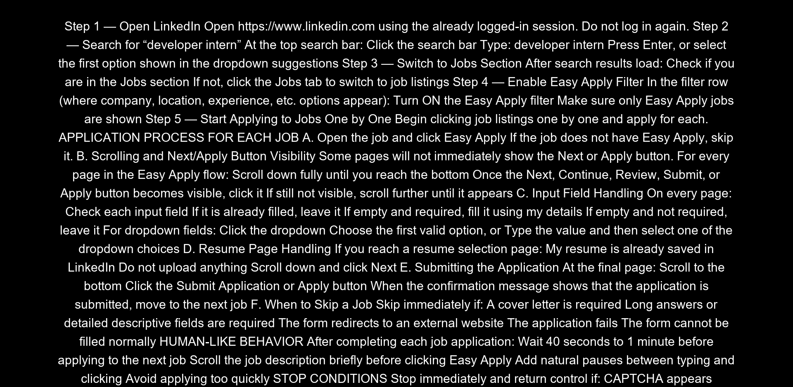

# 🌐 Browser-Use Web UI

<

An AI-powered browser automation tool that lets you control your browser with natural language commands. Built on [browser-use](https://github.com/browser-use/browser-use) with a user-friendly Gradio interface.

## ✨ Features

- **Natural Language Control** - Tell the AI what to do in plain English
- **Multiple LLM Support** - Google Gemini, OpenAI, Anthropic, DeepSeek, Ollama, and more
- **Use Your Own Browser** - Access your existing logins, cookies, and extensions
- **Persistent Sessions** - Browser stays open between tasks
- **Visual Feedback** - Watch the AI interact with your browser in real-time



---

## 🚀 Quick Start (Windows)

### Prerequisites
- Python 3.11+
- Google Chrome browser
- API key for your preferred LLM (Google Gemini, OpenAI, etc.)

### Step 1: Clone & Setup Environment

```powershell
git clone https://github.com/browser-use/web-ui.git
cd web-ui

# Install uv (Python package manager)
pip install uv

# Create virtual environment with Python 3.11
uv venv --python 3.11

# Activate virtual environment
.venv\Scripts\activate

# Install dependencies
uv pip install -r requirements.txt

# Install Playwright browsers
playwright install
```

### Step 2: Configure Environment

```powershell
# Copy example config
cp .env.example .env
```

Edit `.env` and add your API key:
```env
# Add your API key (example for Google Gemini)
GOOGLE_API_KEY=your-api-key-here

# Set default LLM provider
DEFAULT_LLM=google

# Browser settings (use your own Chrome)
BROWSER_PATH=C:\Program Files\Google\Chrome\Application\chrome.exe
BROWSER_USER_DATA=C:\Users\YourUsername\AppData\Local\Google\Chrome\User Data
BROWSER_DEBUGGING_PORT=9242
USE_OWN_BROWSER=true
KEEP_BROWSER_OPEN=true
```

> ⚠️ Replace `YourUsername` with your actual Windows username

### Step 3: Run

Simply execute the startup script:

```powershell
.\start.ps1
```

This script will:
1. ✅ Close any existing Chrome instances
2. ✅ Start Chrome in debug mode with your profile
3. ✅ Launch the WebUI

**Open the WebUI:** Navigate to `http://127.0.0.1:7788` in **Edge or Firefox** (not Chrome!)

---

## 📋 Manual Startup (Alternative)

If you prefer to run commands manually:

```powershell
# 1. Kill all Chrome instances
taskkill /F /IM chrome.exe /T

# 2. Start Chrome in debug mode
Start-Process "C:\Program Files\Google\Chrome\Application\chrome.exe" -ArgumentList "--remote-debugging-port=9242","--user-data-dir=C:\Users\YourUsername\AppData\Local\Google\Chrome\User Data","--start-maximized"

# 3. Activate venv and run
.venv\Scripts\activate
python webui.py
```

---

## ⚙️ Configuration

### Supported LLM Providers

| Provider | Environment Variable | Models |
|----------|---------------------|--------|
| Google | `GOOGLE_API_KEY` | gemini-2.0-flash, gemini-1.5-flash, gemini-2.5-pro |
| OpenAI | `OPENAI_API_KEY` | gpt-4o, gpt-4, gpt-3.5-turbo |
| Anthropic | `ANTHROPIC_API_KEY` | claude-3-5-sonnet, claude-3-opus |
| DeepSeek | `DEEPSEEK_API_KEY` | deepseek-chat, deepseek-reasoner |
| Ollama | `OLLAMA_ENDPOINT` | llama2, qwen2.5, deepseek-r1 |

### Browser Settings

| Setting | Description | Default |
|---------|-------------|---------|
| `BROWSER_PATH` | Path to Chrome executable | - |
| `BROWSER_USER_DATA` | Chrome user data directory | - |
| `BROWSER_DEBUGGING_PORT` | Chrome debug port | 9242 |
| `USE_OWN_BROWSER` | Use your existing browser | true |
| `KEEP_BROWSER_OPEN` | Keep browser open between tasks | true |

---

## 🖥️ WebUI Tabs

### Agent Settings
- Select LLM provider and model
- Adjust temperature and other parameters
- Configure system prompts

### Browser Settings  
- Window size (default: 1920x1080)
- Headless mode option
- Recording and trace paths

### Run Agent
- Enter your task in natural language
- Watch real-time browser interaction
- View agent's thought process

---

## 💡 Usage Tips

1. **Close Chrome First** - Always close all Chrome windows before running `start.ps1`

2. **Use Edge/Firefox for WebUI** - Open `http://127.0.0.1:7788` in a browser other than Chrome

3. **LinkedIn Example** - Your existing LinkedIn login will be preserved when using your own browser profile

4. **Persistent Logins** - Cookies and sessions persist between runs since we use your actual Chrome profile

---

## 🐳 Docker Installation (Optional)

```bash
# Clone and configure
git clone https://github.com/browser-use/web-ui.git
cd web-ui
cp .env.example .env
# Edit .env with your API keys

# Build and run
docker compose up --build
```

Access:
- WebUI: `http://localhost:7788`
- VNC Viewer: `http://localhost:6080/vnc.html` (password: `youvncpassword`)

---

## 📁 Project Structure

```
web-ui/
├── start.ps1              # One-click startup script
├── webui.py               # Main entry point
├── .env                   # Configuration (create from .env.example)
├── requirements.txt       # Python dependencies
├── src/
│   ├── agent/             # Browser automation agents
│   ├── browser/           # Custom browser handling
│   ├── controller/        # Action controllers
│   ├── utils/             # Config, LLM providers
│   └── webui/             # Gradio interface components
├── assets/                # Images and demos
└── tmp/
    ├── agent_history/     # Task recordings (GIFs, JSON)
    ├── downloads/         # Browser downloads
    └── recordings/        # Video recordings
```

---

## 🔧 Troubleshooting

### "Chrome failed to start in debug mode"
- Make sure ALL Chrome windows are closed (check system tray)
- Run `taskkill /F /IM chrome.exe /T` to force close

### "Connection refused on port 9242"
- Chrome isn't running in debug mode
- Run `start.ps1` to properly start Chrome

### Agent not connecting to browser
- Verify Chrome is running with: `Invoke-WebRequest -Uri "http://localhost:9242/json/version"`
- Should return Chrome version info

---

Prompt :

Step 1 — Open LinkedIn
Open https://www.linkedin.com
 using the already logged-in session.
Do not log in again.

Step 2 — Search for “developer intern”
At the top search bar:

Click the search bar

Type: developer intern

Press Enter, or select the first option from the dropdown suggestions

Step 3 — Switch to the Jobs Section
After search results load:

Check if you are in the Jobs section

If not, click the Jobs tab

Step 4 — Enable Easy Apply Filter
In the filter row (where company, location, experience, etc. appear):

Turn ON the Easy Apply filter

Ensure only Easy Apply jobs are shown

Step 5 — Start Applying to Jobs One by One
Click jobs one by one in order.
Apply to each job, then move to the next job continuously (loop through every job: 1st → 2nd → 3rd → 4th, etc.).

APPLICATION PROCESS FOR EACH JOB

A. Open the job and click Easy Apply
If the job does not show Easy Apply, skip it and move to the next job.

B. Scrolling and Button Visibility
Some pages will not show Next or Apply immediately.
For every page:

Scroll down fully until you reach the bottom

When the Next, Continue, Review, Submit, or Apply button becomes visible, click it

If the button is still not visible, scroll further until it appears

C. Input Field Handling
For every input box:

If already filled, leave it

If empty and required, fill using my details (name, email, phone, education, skills)

If empty and not required, leave it
For dropdown menus:

Click the dropdown and select one valid option

Or type the required value and choose from the dropdown list

D. Resume Selection Page
If a resume selection page appears:

My resume is already saved in LinkedIn

Do not upload anything

Scroll down and click Next

E. Submitting the Application
On the final page:

Scroll to the bottom

Click Submit Application or Apply

Wait until the confirmation shows that the application is completed

F. Move to the Next Job
Immediately after finishing one application:

Go back to the job list

Select the next job

Start the same process again
Repeat in a continuous loop for all available Easy Apply Developer Intern jobs.

G. When to Skip a Job
Skip instantly if:

A cover letter is required

Long answer fields appear

The process redirects to an external website

Required fields cannot be filled

The application fails

Then proceed directly to the next job.

HUMAN-LIKE BEHAVIOR

After each job application:

Wait 40 seconds to 1 minute before applying to the next job

Scroll the job description briefly before clicking Easy Apply

Add natural pauses between actions

Avoid applying too quickly or in a repetitive pattern

STOP CONDITIONS

Stop immediately and return control if:

CAPTCHA appears

Multi-factor authentication appears

“Unusual activity detected” appears

Any suspicious or blocking message appears

FINAL OBJECTIVE

Apply to as many Developer Intern Easy Apply jobs in India as possible.
Loop through each job one by one.
Scroll whenever required, fill required fields only, click Next, submit the application, then move directly to the next job.
No resume uploads, no logs, no data saving — only apply.


